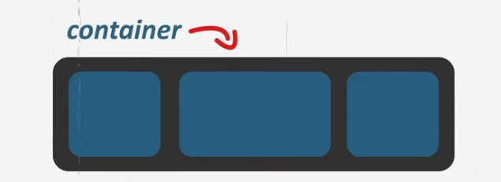
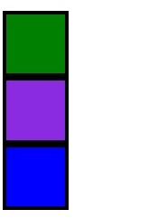
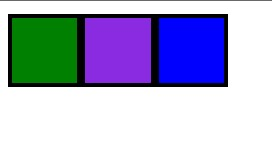
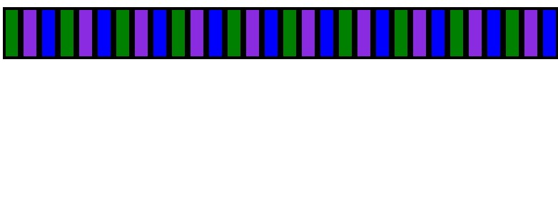
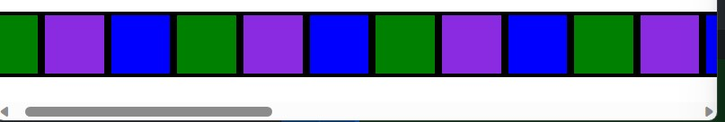

# Flexbox

~ é uma solução para alinhar e distribuir itens em um container.
Principalmente quando o tamanho da pagina é desconhecido ou dinâmico.

Para usar o FLEXBOX precisamos de um container, e o elemento mais utilizado para isso é a div.



Por padrão o html deixa os itens do container assim:


E se no container colocamos a propriedade display como flex, fica assim:

```CSS
    .container {
    display: flex;
}
```



Flex: Deixa a linha flexível, caso haja muitos elementos ele vai dar um jeito para caber tudo, mesmo que mexa na proporção dos elementos.
Exemplo:


Já o inline-flex:


Faria com que tivesse que "ir mais pro lado" para ver o restante dos itens.


