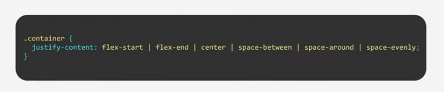

# justify-content

Define o alinhamento dos itens em um container em relação ao eixo principal. Ele ajuda a distribuir o espaço entre esses itens, principalmente quando eles já atingiram o tamanho máximo.

## Opções ...

### flex-start

Faz com que todos os elementos estejam no início do eixo principal.

### flex-end

Itens alinhados com o final do container.

### center

Itens alinhados ao centro.
