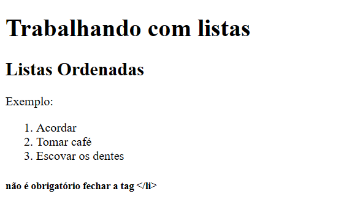
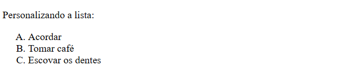
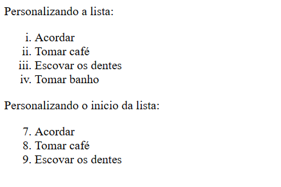

# Listas Ordenadas

Exemplo Básico:

```html
<body>
  <h1>Trabalhando com listas</h1>

  <h2>Listas Ordenadas</h2>
  <p>Exemplo:</p>
  <ol>
    <li>Acordar</li>
    <li>Tomar café</li>
    <li>Escovar os dentes</li>
  </ol>
  <h5>não é obrigatório fechar a tag &lt;/li&gt;</h5>
</body>
```




Exemplo Personalizado 1:

````html
 <p>Personalizando a lista:</p>
    <ol type="A"> <!-- O type serve para personalizar o marcador -->
        <li>Acordar</li>
        <li>Tomar café</li>
        <li>Escovar os dentes</li>
    </ol>
````



Outros 2 exemplos:

````html 
<p>Personalizando a lista:</p>
    <ol type="i"> <!-- O type serve para personalizar o marcador -->
        <li>Acordar</li>
        <li>Tomar café</li>
        <li>Escovar os dentes</li>
        <li>Tomar banho</li>
    </ol>
````
Podemos iniciar a lista a partir de um numero especifico também.

````html 
    <p>Personalizando o inicio da lista:</p>
    <ol start="7">
        <li>Acordar</li>
        <li>Tomar café</li>
        <li>Escovar os dentes</li>
    </ol>
````



Usando o start também mexe com a letra que vai iniciar a lista, ex: start 7 - A lista vai começar do "G". (_O parâmetro "start" só aceita números_).
