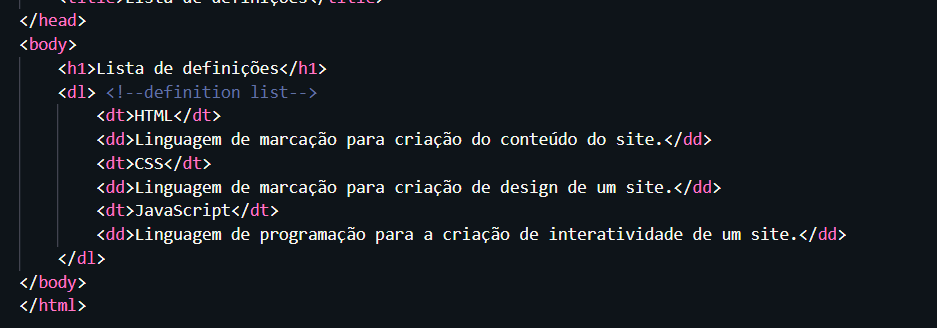
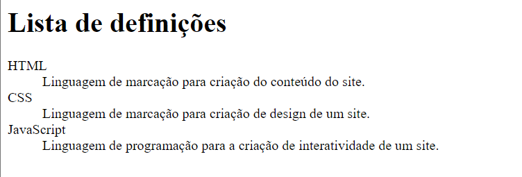

# Lista de definições

#### - < dl > - Define a lista

#### - < dt> -  Definição de Termos (_como se fosse o titulo_)

#### - < dd > - Descreve os termos (_conteúdo relacionado_)

Exemplo de uso: 

Resultado: 

