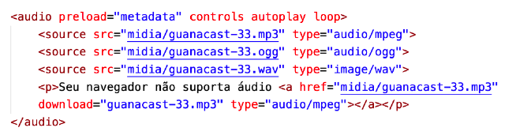

# Audio em HTML

Com a HTML5, veio também a facilidade em compartilhar áudio nos nossos sites e
sem depender necessariamente de JavaScript ou plugins extras. A partir de agora,
basta uma tag < audio > e alguns < source > para fazer seu site ser capaz de tocar
qualquer áudio.

Vamos analisar os principais atributos da tag < audio > antes de mais nada:

- O atributo preload indica se o áudio será pré-carregado ou não e aceita três valores:
    - metadata vai carregar apenas as informações sobre o arquivo (tamanho,
tempo, informações de direitos, etc)
    - none não vai carregar absolutamente nada até que o usuário clique no botão
play ou um script inicie a reprodução
    - auto (padrão) vai carregar o arquivo de áudio inteiro assim que a página for
carregada, mesmo que o usuário nunca aperte o play
- O atributo controls vai apresentar o player na tela. Caso não seja colocado na tag
< audio >, o controle será transparente e o usuário não poderá interagir com ele.
- O atributo autoplay, quando inserido, vai iniciar a reprodução do áudio assim que a página for carregada.
- O atributo loop vai fazer com que o áudio seja repetido eternamente assim que terminar a sua reprodução.

Dentro da tag < audio >, adicionamos vários < source > com formatos diferentes do mesmo áudio. Coloque na parte de cima o seu formato favorito. Os demais só serão carregados caso o de cima falhe. Caso todos falhem, criamos um parágrafo que permite o download do arquivo MP3 para ouvir no player padrão do dispositivo.