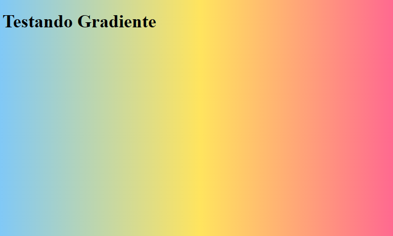
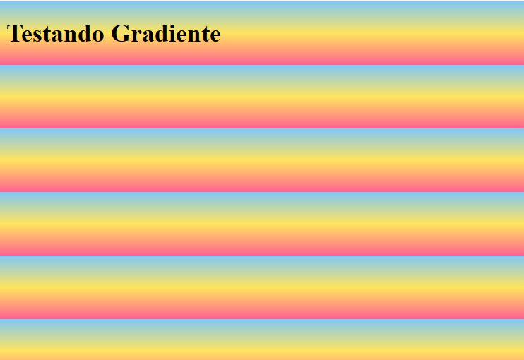
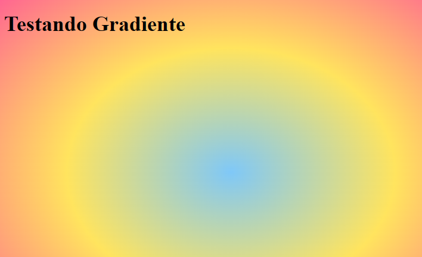

# Cores em CSS (Gradiente)

```html
  <style>
        body {
            background-image: linear-gradient(to right, #7fc8f8, #ffe45e, #ff6392);
        }
```

Resultado:



Sintaxe:

```html
seletor { background-image: linear-gradient(angulo/posição inicial, cor1, color2
...); }
```

~ Angulo direção até o final
Caso não coloque a direção final pode ocorrer isto...


NESTE CASO, resolver sem colocar o angulo, basta adicionar isso no style:

```html
    <style>
        * {
            height: 100%
        }
```

~ **_Isso significa que todos os elementos na página da web terão a mesma altura que o elemento pai deles. Por exemplo, se o elemento pai tiver uma altura de 500 pixels, todos os elementos dentro dele terão uma altura de 500 pixels também._**

Observe que a primeira cor da ordem é a que abre o gradiente, até a cor final/ultima.

Existem várias direções possíveis em um gradiente CSS! Você pode definir a direção do gradiente usando palavras-chave como "to bottom" (de cima para baixo), "to top" (de baixo para cima), "to right" (da esquerda para a direita) e "to left" (da direita para a esquerda). Além disso, você também pode definir a direção do gradiente usando um ângulo.

Exemplo:

```html
<style>
  body {
    background-image: linear-gradient(180deg, red, yellow);
  }
</style>
```

Video que pode ajudar: https://www.youtube.com/shorts/lz7B0wKXFxM

# radial-gradiente

```
body {
    background-image: radial-gradient( #7fc8f8, #ffe45e, #ff6392);
        }
```


